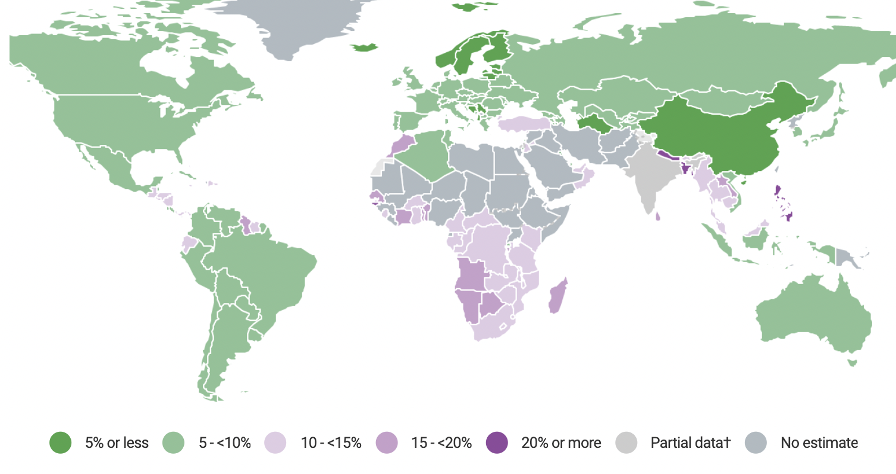
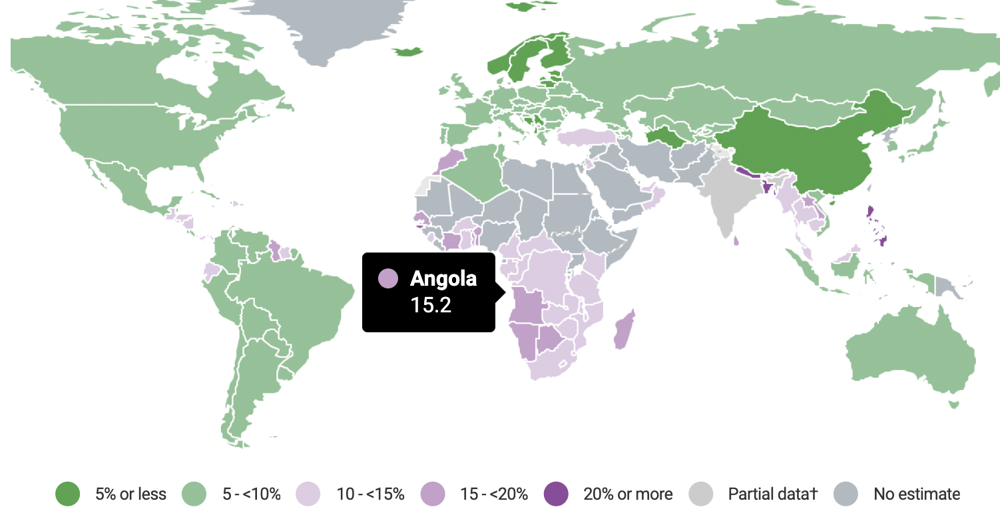
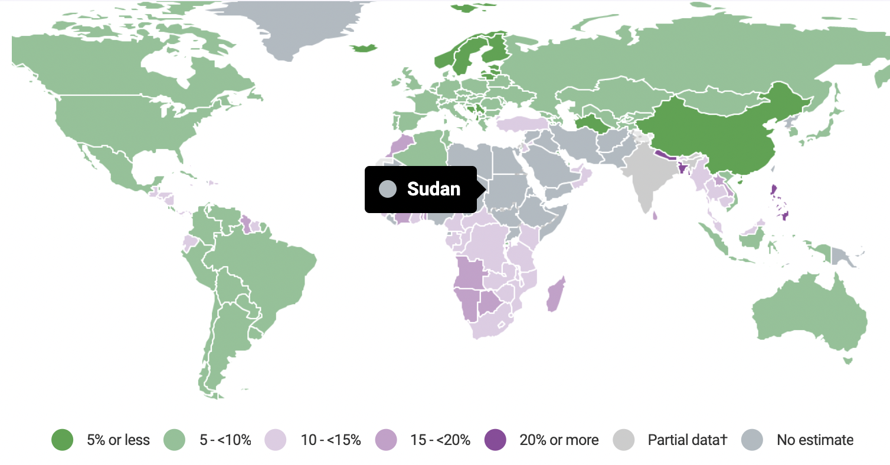
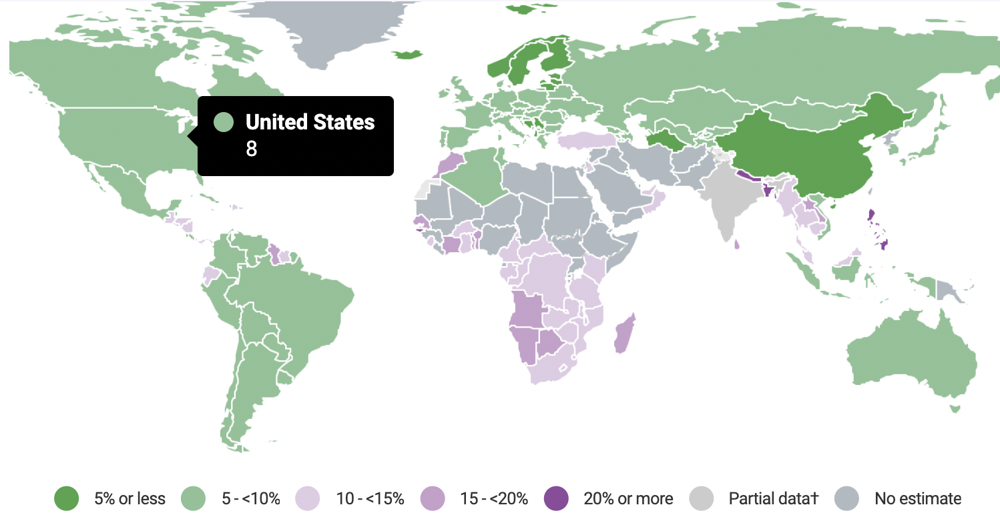
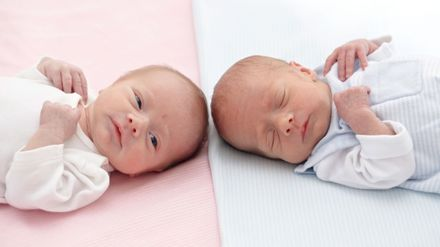

---
title: "Low Birth Weight"
subtitle: "What, Why, How?"
output:
  xaringan::moon_reader:
    css: ["default", "rladies", "rladies-fonts" ]
    lib_dir: libs
    nature:
      highlightStyle: github
      highlightLines: true
      countIncrementalSlides: false
      navigation:
        scroll: false # disable slide transitions by scrolling

---

background-image:url(LBW-blog.jpeg)
background-position: 50% 50%
class: center, bottom, inverse
background-size:cover

# Low Birth Weight: What is it?
---
## Low Birth Weight: What is it?

- criteria: birthweight less than `2500 grams` (WHO).
- prevalence: `15%` (UNICEF, 2015). 
- influence: `lower IQ`, `stunted growth`, or even `death`. 


```{r,echo=FALSE}

```
---

## Low Birth Weight: What is it?

- criteria: birthweight less than `2500 grams` (WHO).
- prevalence: `15%` (UNICEF, 2015). 
- influence: `lower IQ`, `stunted growth`, or even `death`. 


```{r,echo=FALSE}

```
---
## Low Birth Weight: What is it?

- criteria: birthweight less than `2500 grams` (WHO).
- prevalence: `15%` (UNICEF, 2015). 
- influence: `lower IQ`, `stunted growth`, or even `death`. 


```{r,echo = FALSE}

```
---
## Low Birth Weight: What is it?

- criteria: birthweight less than `2500 grams` (WHO).
- prevalence: `15%` (UNICEF, 2015). 
- influence: `lower IQ`, `stunted growth`, or even `death`. 


```{r,echo = FALSE}

```

---


background-image:url("des-baystate.jpg")
background-position: 50% 50%
class: center, bottom, inverse
background-size:cover

## Low Birth Weight: Why is it?
---
## Low Birth Weight: Why is it?
### Data description

.scroll-output[
Variable | Description
------ | ------
low | indicator of birth weight less than 2.5kg
age | mother's age in years
lwt | mother's weight in pounds at last menstrual period
race | mother's race(1 = white, 2 = black, 3 = other)
smoke | smoking status during pregnancy
pt1 | number of previous premature labours
ht | history of hypertension
ui | presence of uterine irritability
ftv | number of physician visits during the first trimester
bwt | birth weight in grams


```{r ,results = "hide", message = FALSE, echo=FALSE}
library(MASS)
birthwt
```

]


---
## Low Birth Weight: Why is it?
### Pairplot Matrix of Continuous Variables
```{r, message = FALSE, echo = FALSE,fig.align = 'center'}
library(tidyverse)
birthwt_continuous=birthwt%>%
  select(bwt,age,lwt)
qtlcharts::iplotCorr(birthwt_continuous)
# birthwt_continuous%>%
#    GGally::ggpairs()

 # cowplot::plot_grid(
 #   ggmatrix_gtable(p1),
 #   ggmatrix_gtable(p2),
 #   nrow = 2)

```

---
## Low Birth Weight: Why is it?
### Pairplot Matrix of Categorical Variables
```{r,echo = FALSE, fig.width=6,fig.height=6,message=FALSE, warning=FALSE,fig.align = 'center'}
cols=c("low","race","smoke","ptl","ht","ui")
birthwt1=birthwt%>%
mutate(across(all_of(cols),factor))
birthwt_categorical=birthwt1%>%
  select(low,race,smoke,ptl,ht,ui,bwt)

birthwt_categorical%>%
  GGally::ggpairs()

```
---


## Low Birth Weight: Why?
### Multiple Linear Regression Model

First we define the model with population parameters: 

.content-box-yellow[
$$\bar{bwt}=\beta_0+\beta_1low+\beta_2age+\beta_3lwt+\beta4race+\beta_5smoke+\beta_6ptl+\beta_7ht+\beta_8ui+\beta_9ftv$$
]

--
```{r,message = FALSE}
lm_birthwt=lm(bwt~.,data=birthwt)
lm_birthwt
```
--
- Full Model: 
$$\bar{bwt}=3613−1131.22low−6.25age+1.05lwt−100.91race−174.12smoke+81.34ptl−181.96ht−336.78ui−7.58ftv$$
---
## Low Birth Weight: Why?

```{r}
{{summary(lm_birthwt)}}
```
---
## Low Birth Weight: Why?
### Variable Selection
```{r}
M1=lm(bwt~.,data=birthwt)
drop1(M1,test="F")
```
---
## Low Birth Weight: Why?
### Variable Selection

```{r}
M2=update(M1, . ~ . -ftv)
M2
```

---
## Low Birth Weight: Why?
### Variable Selection
```{r}
{{step_backward_birthwt=step(lm_birthwt,direction="backward",test="F",trace=F)}}
step_backward_birthwt
```
--
- Reduced Model:

$$
\bar{bwr}=3586.50−1139.20low−97.34race−157.42smoke−303.19ui
$$
---
## Low Birth Weight: Why?
### 4 Assumptions Checking: Large Butterfly?
```{r,echo=FALSE, fig.width=6,fig.height=6,fig.align = 'center'}
library(ggfortify)
lm_birthwt_reduced=step_backward_birthwt
autoplot(lm_birthwt_reduced,which=1:2) + theme_bw()
```
---
## Low Birth Weight: Why?
### Log Transformation
```{r}
{{lm_loglinear = lm(log(bwt)~low+race+smoke+ui, birthwt)}}
```
```{r,echo=FALSE,result, fig.width=5,fig.height=5,fig.align = 'center'}
autoplot(lm_loglinear, which=1:2)+theme_bw()
```

---
## Low Birth Weight: Why?
### Reduced Model before vs after transformations
```{r}
{{lm_loglinear = lm(log(bwt)~low+race+smoke+ui, birthwt)}}
```

```{r,echo=FALSE,fig.align = 'center',fig.width=5,fig.height=10,message=FALSE}
library(gridExtra)
p1=autoplot(step_backward_birthwt,which=1)+theme_bw()
p2=autoplot(lm_loglinear,which=1)+theme_bw()
gridExtra::grid.arrange(p1@plots[[1]],p2@plots[[1]],nrow=2,ncol=2)
```
---
## Low Birth Weight: Why?
### Model Performance Comparison

```{r,echo=FALSE,message=FALSE,fig.align = 'center',results='hide'}
#install.packages("caret")
library(caret)
cv_Full=train(
  bwt~.,data=birthwt,
  method="lm",
  trControl=trainControl(
    method="cv",number=10,
    verboseIter=FALSE
  )
)
cv_Full

cv_Reduced=train(
  bwt~low+ui+race+smoke,data=birthwt,
  method="lm",
  trControl=trainControl(
    method="cv",number=10,
    verboseIter=FALSE
  )
)
cv_Reduced

cv_Tranformation=train(
  log(bwt)~low+ui+race+smoke,data=birthwt,
  method="lm",
  trControl=trainControl(
    method="cv",number=10,
    verboseIter=FALSE
  )
)
cv_Tranformation


```
```{r,echo=FALSE,message=FALSE,fig.align = 'center',fig.width=10,fig.height=6}
df <- bind_rows(cv_Full$results, cv_Reduced$results, cv_Tranformation$results)
df$model <- c("Full", "Reduced", "Transformation")
p_1=ggplot(df, aes(x=model, y=RMSE, group=1)) + geom_line() + geom_point()
p_2=ggplot(df, aes(x=model, y=MAE , group=1)) + geom_line() + geom_point()
p_3=ggplot(df, aes(x=model, y=Rsquared , group=1)) + geom_line() + geom_point()
gridExtra::grid.arrange(p_1,p_2,p_3,nrow=1)
```

---
## Low Birth Weight:Why?
### Interpretation
- Reduced Model with Transformation:
$$\log(\bar{bwt})=-0.44*low-0.03*race-0.04*smoke-0.14*ui$$
- Low indicator in birth weight reduces birth weight by `44%`. 
- Babies from black or other demographic groups are more likely to have lower weight than white, `3%` and `6%` respectively. 
- Smoking reduces birthweight by `4%`. 
- uterine iritatability reduces birthweight by `14%`. 

---
## Low Birth Weight:Why?
### Limitations
- `Sampling Bias`

```{r,echo=FALSE}

```
---
## Low Birth Weight:Why?
### Limitations
- `Limited Variables`

```{r,echo=FALSE}

```
---
## Low Birth Weight:Why?
### Limitations
- `Outdated Data`
```{r,echo=FALSE}


```

---
# Low Birth Weight:What Should Moms Do?
## Conclusions
### Appeal 1: THE EARLIER THE BETTER!
---
# Low Birth Weight:What Should Moms Do?
## Conclusions
### Appeal 1: THE EARLIER THE BETTER!
### Appeal 2: NO RACE IS EXCEPTED!
---
# Low Birth Weight:What Should Moms Do?
## Conclusions
### Appeal 1: THE EARLIER THE BETTER!
### Appeal 2: NO RACE IS EXCEPTED!
### Appeal 3: Kill Smoking before it kills your baby!
---
background-image:url(mom.jfif)
background-position: 50% 50%
class: center, bottom, inverse
background-size:cover
# A Good Start in Life Begins in the Womb
---
background-image:url(mom.jfif)
background-position: 50% 50%
class: center, bottom, inverse
background-size:cover
# Thank you!